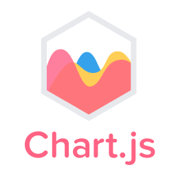

## Hi 👋

### I'm a Web developer⚡

<div align="center">
    
    
</div>

<div align="center">
  
  [](https://git.io/streak-stats)
</div>

<!--START_SECTION:waka-->

```txt
Python       22 hrs 27 mins  █████████████░░░░░░░░░░░░   52.45 %
Vue.js       12 hrs 53 mins  ███████▓░░░░░░░░░░░░░░░░░   30.11 %
TypeScript   3 hrs 12 mins   ██░░░░░░░░░░░░░░░░░░░░░░░   07.49 %
Markdown     2 hrs 2 mins    █▒░░░░░░░░░░░░░░░░░░░░░░░   04.75 %
YAML         1 hr            ▓░░░░░░░░░░░░░░░░░░░░░░░░   02.35 %
```

<!--END_SECTION:waka-->


<h3 align="center">Backend</h3>

<div align="center">
    
    
    
    
    
    
    
    
    
    
</div>


<h3 align="center">Frontend</h3>

<div align="center">
    
    
    
    
    
    
</div>


<h3 align="center">DevOps</h3>

<div align="center">
    
    
    
    
</div>

<h3 align="center">My stack</h3>

<div align="center">
    
    
</div>
