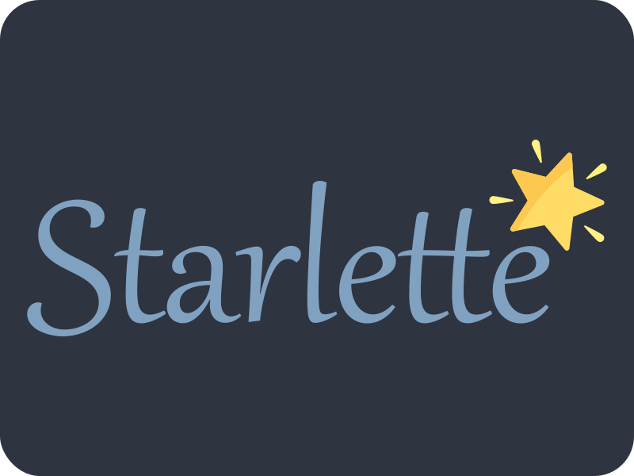

## Hi 👋

<div align="center">
    
    
</div>

<div align="center">
  
  [](https://git.io/streak-stats)
</div>

<!--START_SECTION:waka-->

```txt
Python       33 hrs 3 mins   ██████████████████████▒░░   89.06 %
Markdown     2 hrs 4 mins    █▒░░░░░░░░░░░░░░░░░░░░░░░   05.61 %
YAML         1 hr 2 mins     ▓░░░░░░░░░░░░░░░░░░░░░░░░   02.82 %
XML          12 mins         ░░░░░░░░░░░░░░░░░░░░░░░░░   00.56 %
Makefile     10 mins         ░░░░░░░░░░░░░░░░░░░░░░░░░   00.47 %
```

<!--END_SECTION:waka-->


<h3 align="center">Backend</h3>

<div align="center">
    
    
    
    
    
    
    
    
    
    
</div>


<h3 align="center">Frontend</h3>

<div align="center">
    
    
    
    
    
    
</div>


<h3 align="center">DevOps</h3>

<div align="center">
    
    
    
    
</div>

<h3 align="center">My stack</h3>

<div align="center">
    
    
</div>
